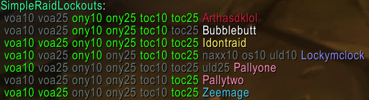
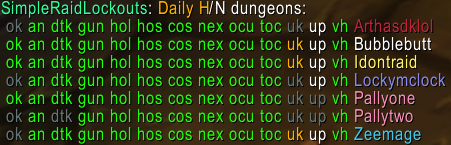
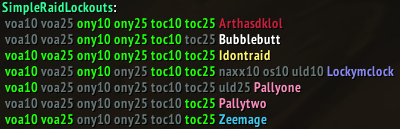
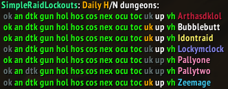

# Simple Raid Lockouts by bencvt

Keep track of your characters' lockouts without having to switch or dig through addon menus.

This addon/plugin is for World of Warcraft (Wrath Classic).
**It requires the [Nova Instance Tracker](https://www.curseforge.com/wow/addons/nova-instance-tracker) addon.**

It adds a slash command `/lo` (or `/srl`) to print all max level raid lockouts for all your characters in the chat box.

This is equivalent to clicking the NIT mini-map button, then Lockouts, but it's output in an easier-to-read format, excluding dungeons and non-max-level raids.

## Additional features

You can also use `/lo d` to print all max level heroic dungeon lockouts for all your characters.

## Examples

Raids:  

Dungeons:  

Raids with ElvUI:  

Dungeons with ElvUI:  

## Links

 * https://www.curseforge.com/wow/addons/simple-raid-lockouts - download and install this addon from CurseForge, or use your addon manager of choice
 * https://github.com/bencvt/SimpleRaidLockouts - source repo
